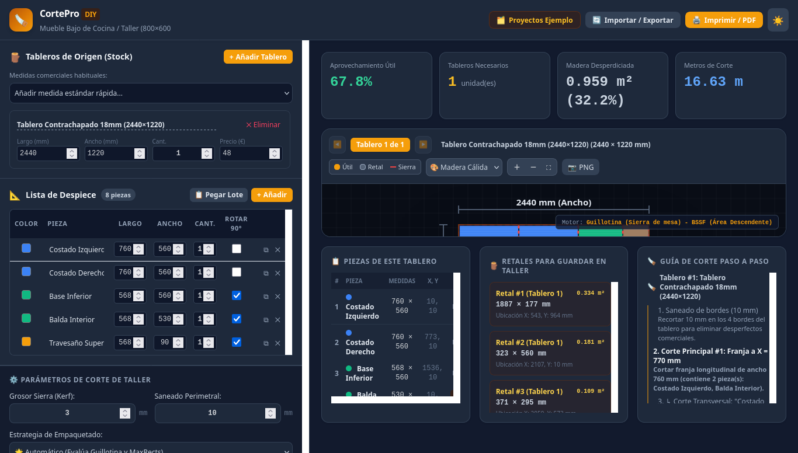

# 🪚 CortePro DIY - Optimizador de Corte de Tableros 2D

Aplicación web SPA (Single Page Application) moderna, reactiva y especializada para aficionados a la carpintería y el DIY que optimiza el despiece y corte de tableros de madera, contrachapado y aglomerado (2D Cutting Stock Problem) minimizando el desperdicio.



---

## ✨ Características Principales

1. **Gestor de Tableros Comerciales (Stock):**
   - Configuración de dimensiones (Largo, Ancho, Cantidad, Precio y Nombre de material).
   - Presets comerciales rápidos tanto para sistema Métrico (`2440×1220 mm`, `2500×1250 mm`, `1200×600 mm`...) como Imperial (`96×48 in`, `60×60 in`, `48×48 in`...).

2. **Lista de Despiece y Control de Veta:**
   - Tabla reactiva de piezas requeridas (Nombre, Dimensiones, Cantidad, Color visual).
   - **Control de Veta:** Checkbox por pieza para permitir o bloquear la rotación de 90° (para piezas con orientación de veta obligatoria).
   - **Pegado masivo (Bulk Add):** Pega filas directamente desde hojas de cálculo (Excel, Google Sheets) o texto plano.

3. **Selector Rápido de Unidades (Métrico `mm` / Imperial `in`):**
   - Toggle destacado en la cabecera para alternar entre el **Sistema Métrico Internacional (`mm`, $\text{m}^2$, $\text{m}$)** y el **Sistema Imperial (`in` / pulgadas, $\text{sq ft}$, $\text{ft}$)** con conversión matemática automática de todas las dimensiones.

4. **Parámetros de Corte de Taller:**
   - **Grosor de Sierra (Kerf):** Configurable (por defecto 3 mm / 0.125"), restado con precisión milimétrica entre piezas adyacentes.
   - **Saneado Perimetral (Trimming margin):** Margen de limpieza exterior del tablero (por defecto 10 mm / 0.5").
   - **Motor Multi-Algoritmo:**
     - *Automático:* Evalúa múltiples heurísticas y selecciona la de mayor aprovechamiento.
     - *Guillotina:* Cortes pasantes de borde a borde específicos para sierra de mesa o escuadradora.
     - *MaxRects:* Empaquetado libre de máxima densidad para corte CNC o caladora.

5. **Visualizador Interactivo en Canvas:**
   - Renderizado en alta resolución Retina/HiDPI.
   - Zoom interactivo (con rueda de ratón o botones), paneo con arrastre y auto-ajuste.
   - 3 estilos visuales: *Madera Cálida*, *Plano Técnico Blueprint* y *Alto Contraste*.
   - Cotas acotadas y tooltips flotantes interactivos al pasar el ratón.
   - Exportación de planos de corte en imágenes PNG de alta resolución.

6. **Panel de Estadísticas y Taller:**
   - Métricas en tiempo real: % de aprovechamiento útil, número de tableros necesarios, área desperdiciada y longitud total de corte.
   - **Inventario de retales aprovechables:** Listado de sobrantes utilizables con sus medidas exactas y ubicación.
   - **Guía de corte paso a paso:** Secuencia ordenada de cortes longitudinales (Rip cuts) y transversales (Cross cuts).

7. **Persistencia e Informes de Impresión / PDF:**
   - Persistencia automática de todos los datos en `localStorage`.
   - Botón **Nuevo Proyecto (Desde 0)** para empezar en blanco.
   - Presets de proyectos reales (Mueble de cocina, Estantería 4 baldas, Caja de herramientas, Mesa de centro).
   - Importación y exportación en formatos JSON y CSV.
   - Hoja de taller optimizada para imprimir o guardar en PDF (`@media print` con casillas de verificación `[ ]` para marcar cortes realizados).

---

## 🚀 Cómo Ejecutar el Proyecto Localmente

No requiere Node.js ni instalación de dependencias pesadas. Puedes servirlo con cualquier servidor web estático:

### Con Python 3:
```bash
python3 -m http.server 8080
```
Abre tu navegador en: `http://localhost:8080/`

---

## 📁 Estructura del Proyecto

```text
├── index.html                  # Interfaz SPA principal
├── css/
│   └── styles.css              # Estilos de taller y reglas de impresión @media print
├── js/
│   ├── app.js                  # Controlador principal y gestión de estado
│   ├── presets.js              # Presets de proyectos y medidas comerciales
│   ├── engine/
│   │   ├── packer.js           # Algoritmos Guillotina y MaxRects 2D Bin Packing
│   │   └── optimizer.js        # Motor de optimización multi-heurística y estadísticas
│   └── renderer/
│       └── canvasRenderer.js   # Renderizador Canvas interactivo (Zoom, Pan, Cotas)
├── screenshot_final.png        # Captura de pantalla de la aplicación
└── README.md                   # Documentación del proyecto
```

---

## 📄 Licencia
Este proyecto está bajo la Licencia MIT.
